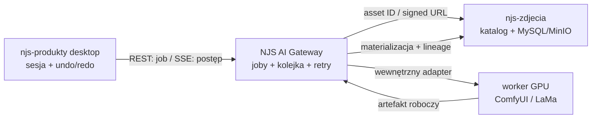

# ADR-0001: granice systemu edycji obrazów AI

- Status: accepted
- Story: Shortcut #1678 / AI-001
- Date: 2026-08-04

## Decyzja

`njs-produkty` komunikuje się wyłącznie z NJS AI Gateway. Gateway jest właścicielem
trwałego rekordu zadania, kolejki, retry, anulowania i zdarzeń postępu. Worker GPU
nie jest publicznym API i nie może być wywoływany bezpośrednio przez desktop.

`njs-zdjecia` pozostaje centralnym katalogiem artefaktów i źródłem prawdy dla
oryginałów, masek, podglądów i wyników. Udostępnia identyfikatory assetów oraz
krótkotrwałe podpisane URL-e. Gotowość tej integracji jest zależnością dla pełnego
E2E, ale nie blokuje lokalnego benchmarku workerów.

Sesja edycji, undo/redo i niezapisane warianty należą do desktopu i są lokalne,
efemeryczne. Po materializacji desktop wysyła artefakt do `njs-zdjecia`, a Gateway
zapisuje lineage: wejściowe asset ID, wersję workflow/modelu i wynikowe asset ID.

Publiczny transport to REST + SSE. REST tworzy i odczytuje joby, SSE przesyła
postęp i stan terminalny; polling jest fallbackiem. WebSocket pozostaje wyłącznie
wewnętrznym szczegółem adaptera ComfyUI. Operacje przyjmują asset ID lub podpisany
URL, nigdy ścieżkę pliku z komputera operatora.

## Odpowiedzialności i kontrakty

| Komponent | Jest właścicielem | Nie jest właścicielem |
| --- | --- | --- |
| `njs-produkty` | lokalna sesja edycji, undo/redo, wybór maski, UI | kolejka GPU, retry, ścieżki workerów |
| NJS AI Gateway | job, idempotency key, scheduler jednego GPU, retry, cancel, SSE | źródłowy katalog zdjęć, stan undo |
| `njs-zdjecia` | assety, metadane, podpisane URL-e, lineage | wykonanie modeli i kolejka GPU |
| worker | pojedyncza inferencja według manifestu | autoryzacja użytkownika, publiczne API, trwały job |

Stany joba: `queued`, `running`, `succeeded`, `failed`, `cancel_requested`,
`cancelled`. Publiczne parametry workflow są semantyczne (`image`, `mask`,
`points`, `transparent_image`). Numery węzłów ComfyUI są wyłącznie bindingiem w
wersjonowanym manifeście i nie wyciekają do desktopu.

## Tryb offline i cache

Desktop może utrzymać zaszyfrowany cache podglądów i niedokończoną sesję, ale
nie udaje centralnego katalogu. Gateway i workery nie pobierają modeli przy
obsłudze joba: używają wcześniej zweryfikowanego cache/checkpointu. Przy braku
`njs-zdjecia` można kontynuować lokalne undo/redo, lecz utworzenie nowego joba lub
materializacja wyniku kończą się kontrolowanym błędem `asset_catalog_unavailable`.

## Failure modes

| Awaria | Zachowanie |
| --- | --- |
| `njs-zdjecia` niedostępne | job nie startuje bez wejścia; wynik oczekuje na materializację i ma jawny stan |
| signed URL wygasł | Gateway odświeża go raz; później błąd możliwy do retry bez utraty joba |
| worker/GPU niedostępny | job pozostaje w kolejce lub retry z backoff; desktop nie przełącza endpointu |
| brak modelu/custom node | readiness i smoke test blokują worker przed przyjęciem pracy |
| przerwany SSE | klient wznawia przez `Last-Event-ID` albo przechodzi na polling |
| anulowanie w trakcie inferencji | `cancel_requested`, następnie `cancelled`; wynik częściowy nie jest publikowany |
| restart Gateway | stan joba odtwarzany z trwałego store; lokalna sesja desktopu pozostaje niezależna |
| brak miejsca | preflight odrzuca job, a tymczasowe pliki są sprzątane po terminalnym stanie |

## Plan migracji

1. Wprowadzić manifesty i walidator bez zmiany obecnych narzędzi diagnostycznych.
2. Dodać Gateway i adaptery workerów; porty workerów nadal wiążą się z loopbackiem
   lub prywatną siecią Docker.
3. Przenieść desktop z bezpośrednich/lokalnych wywołań na REST jobów i SSE.
4. Podłączyć `njs-zdjecia`, asset IDs, podpisane URL-e i lineage.
5. Wyłączyć każdy bezpośredni dostęp desktopu do ComfyUI/IOPaint i egzekwować to
   testem integracyjnym oraz konfiguracją sieci.

## Konsekwencje

REST + SSE upraszcza autoryzację, reconnect i obserwowalność kosztem braku kanału
dwukierunkowego; anulowanie nadal jest zwykłym endpointem REST. Gateway staje się
obowiązkową granicą niezawodności. `njs-zdjecia` musi być gotowe przed produkcyjnym
E2E, ale workery i benchmark pozostają od niego niezależne.
